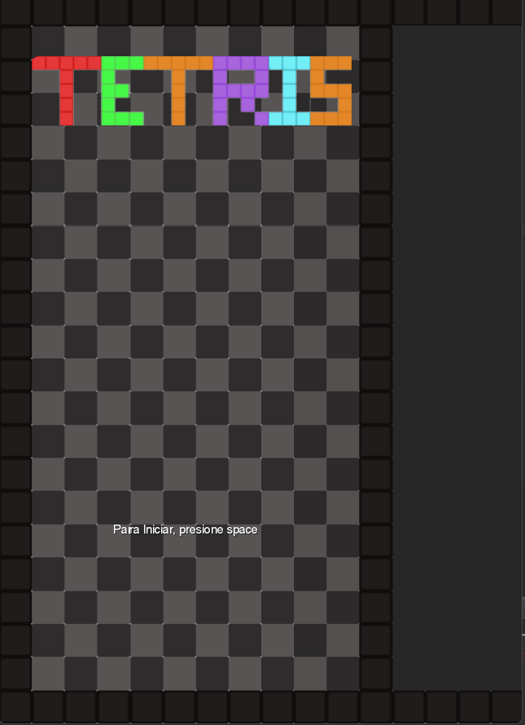
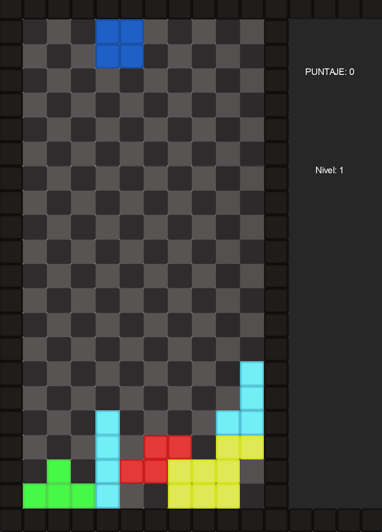

# TETRIS

## Equipo de desarrollo

- Jonatan Raijman
- Ignagio Knobel
- Tomas Zignego
- Nahuel Garcia
- Tomas Garbossa

## Capturas

## Reglas de Juego / Instrucciones

- Objetivo:

      El objetivo del juego es eliminar las piezas que caen (llamadas "tetriminos") llenando filas horizontales completas en el tablero para evitar que se acumulen hasta la parte superior.

- Controles:

      Movimiento lateral: Utiliza las teclas de dirección izquierda y derecha para desplazar el tetrimino en esas direcciones.
      Girar: Puedes rotar el tetrimino presionando la tecla E o Q.
      Caída rápida: Presiona la tecla de dirección abajo para hacer que el tetrimino caiga rápidamente hacia abajo.
      Cambiar nivel: Presiona las teclas numéricas 1, 2, 3 o 4 para cambiar el nivel del juego.
- Juego:

      Los tetriminos caen desde la parte superior de la pantalla.
      Debes girar y mover los tetriminos para que encajen y llenen las filas horizontales.
      Cuando una fila se completa sin espacios vacíos, se elimina.
      Ganas 10 puntos por cada fila que se completa.
      A medida que avanzas en el juego, la velocidad de caída de los tetriminos aumenta con cada nivel.

- Niveles:

      Comienzas en el nivel 1, que es el nivel más lento.
      Presiona las teclas numéricas 1, 2, 3 o 4 para cambiar al nivel deseado.
      Cada nivel aumenta la velocidad de caída de los tetriminos, lo que hace que el juego sea más desafiante.
- Puntuación:

      Ganas 10 puntos por cada fila completada.
      La puntuación se acumula a medida que avanzas en el juego.
    

## Otros

- Curso/Facultad
- Versión de wollok
- Una vez terminado, no tenemos problemas en que el repositorio sea público
